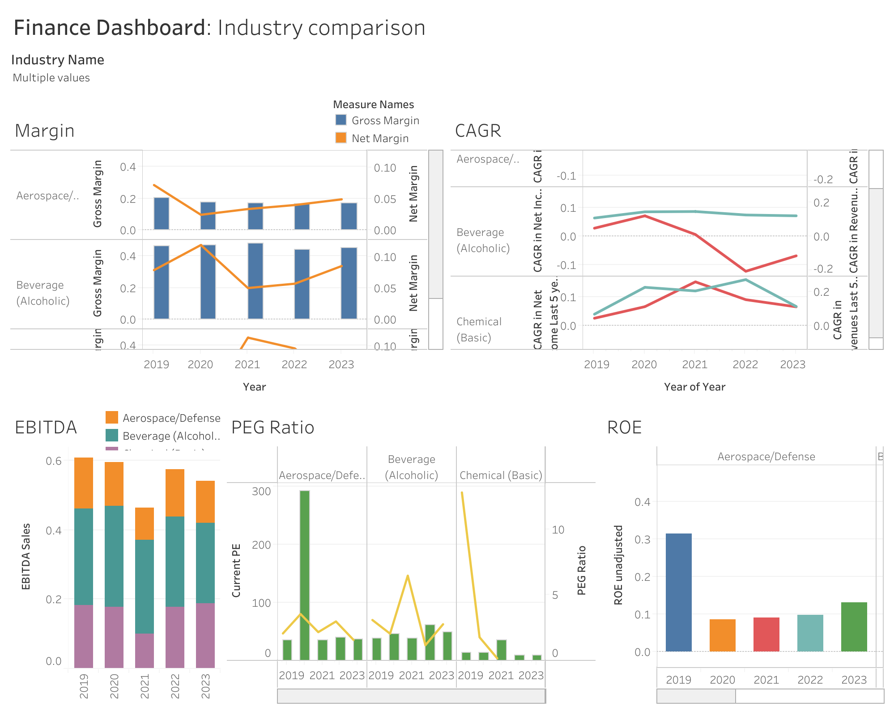

# Financial-Analysis-Tableau
A Tableau dashboard to analyze financial trends. 

This project involves creating a comprehensive financial dashboard using Tableau. The dashboard provides insights into various financial metrics across different industries over the years. The main focus is on comparing key performance indicators (KPIs) such as growth, return on equity (ROE), gross margin, net margin, and other relevant metrics.

## Description

The dashboard is divided into several sections, each highlighting different aspects of the financial data. The sections include:

1. **Year Comparison**:
    - **Table**: Displays the number of firms in each industry for the years 2019 to 2023.
    - **Growth**: Expected growth in EPS (Earnings Per Share) and revenue for the next two years, plotted for different years.

2. **Industry Comparison**:
    - **Margin**: Shows gross and net margins for selected industries over the years.
    - **CAGR (Compound Annual Growth Rate)**:
        - CAGR in Net Income for the last 5 years.
        - CAGR in Revenues for the last 5 years.
    - **EBITDA (Earnings Before Interest, Taxes, Depreciation, and Amortization)**: EBITDA as a percentage of sales for different industries.
    - **PEG Ratio (Price/Earnings to Growth)**: Current PE and PEG ratio for different industries.
    - **ROE (Return on Equity)**: Unadjusted ROE for different industries.

3. **Gross Margin: All**:
    - **Tree Map**: Visual representation of gross margin for all industries.

## Key Performance Indicators (KPIs) Explored

1. **Number of Firms**: The total number of firms in each industry for each year from 2019 to 2023.
2. **Gross Margin**: The gross margin for each industry, indicating the percentage of revenue that exceeds the cost of goods sold (COGS).
3. **Net Margin**: The net margin for each industry, showing the percentage of revenue left after all expenses have been deducted. Estimated by dividing the net income by the total revenues: Net Margin = Net Income / Sales
4. **CAGR in Net Income**: The compound annual growth rate in net income over the last 5 years.
5. **CAGR in Revenues**: The compound annual growth rate in revenues over the last 5 years.
6. **Current PE**: The current price-to-earnings ratio for each industry.
7. **EBITDA Sales**: EBITDA as a percentage of sales for different industries. Estimated by adding depreciation and amortization back to operating income (EBIT).
8. **Expected Growth in EPS**: The expected growth in earnings per share over the next five years.
9. **Expected Growth in Revenues**: The expected growth in revenues over the next two years.
10. **PEG Ratio**: The price/earnings to growth ratio, which considers the current PE ratio and the expected growth rate.
11. **ROE (Unadjusted)**: The return on equity for each industry, calculated as net income divided by shareholder's equity.

